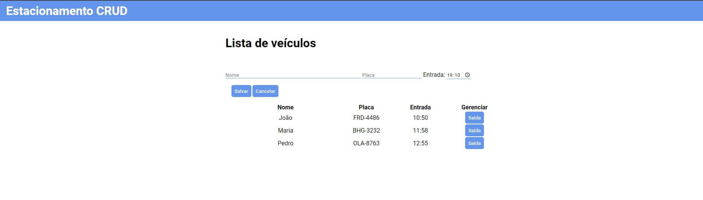

# Estacionamento (CRUD)

## Índice

* [Informação geral](#informação-geral)
* [Tecnologias](#tecnologias)
* [Setup](#setup)
* [Resultado](#resultado)

<br>

## Informação geral

Desafio do curso de Typescript da [DIO](https://www.dio.me/) para criar um cadastro de veículos no pátio de estacionamento.

<br>	

## Tecnologias

Projeto criado com:

<div> Typescript</div>
<div> Javascript</div>
<div> HTML</div>
<div> CSS</div>
<div> Eslint</div>

<br>

## Setup

Para abrir a aplicação, basta entrar em index.html.

Para instalar as dependências de desenvolvimento:

```
npm install
```

Para deixar o compilador typescript observando a pasta src:

```
npx tsc -w
```
<br>

## Resultado

Confira aqui: [https://mauricio-mds.github.io/estacionamento-crud/](https://mauricio-mds.github.io/estacionamento-crud/) 

<a href="https://mauricio-mds.github.io/estacionamento-crud/"></a>

Foi criada uma tela de cadastro de entrada de veículos com persistência de dados no local storage do browser. O horário padrão de entrada do veículo é o horário do sistema. Ao registrar saída do veículo, é calculado quanto tempo o veículo ficou estacionado.
